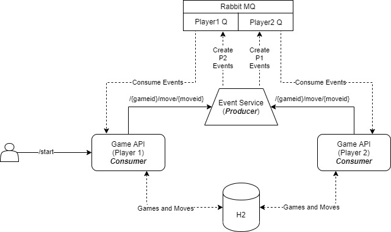

# Getting Started
Reference Documentation for 'Game of Three' REST API game

### Architechture and Technologies

Communication between two players is enabled via events, this is achieved by having an Event Service REST API which acts as common event producer for both the player applications. The players call event service to publish events to opponent's queue. The players themselves being REST API's and event consumers.

For each move made by the player1, an event is generated and sent to opponent's queue which is read by opponent and reverts back with the move in form of event which is again read by player1.

All the Games and Moves of each game are persisted in DB(H2)
Event payload contains gameId and moveId. The consumer fetches the move from DB

All the requirements and validations from the assignment document has been satisfied.
Manual/Automatic input configuration has been made in the configuration files.

- Java 8
- Spring Boot
- Rabbit MQ
- Maven
- H2 Database

### Prerequisites
- A local installation of Rabbit MQ server is required for this service to run (To consume the messages and for the event service to publish). Messaging queue names has been mentioned in the configuration files.
- [Event service REST API](https://github.com/bharadwajap/gameofthree-event-service) should be run before starting the players.

### How to Build and Run
Project is build using Maven.

Run below commands to bring both the players up and running. Based on the configuration files, both players run on different
ports with different application names.

`java -Dspring.profiles.active=player1 -jar gameofthree-player-service-0.0.1-SNAPSHOT.jar`

`java -Dspring.profiles.active=player2 -jar gameofthree-player-service-0.0.1-SNAPSHOT.jar`

### Documentation
Swagger has been configured with the service and API documentation can be viewed at below endpoint after starting the application.

`http://localhost:8091/gameofthree/swagger-ui.html#/`
